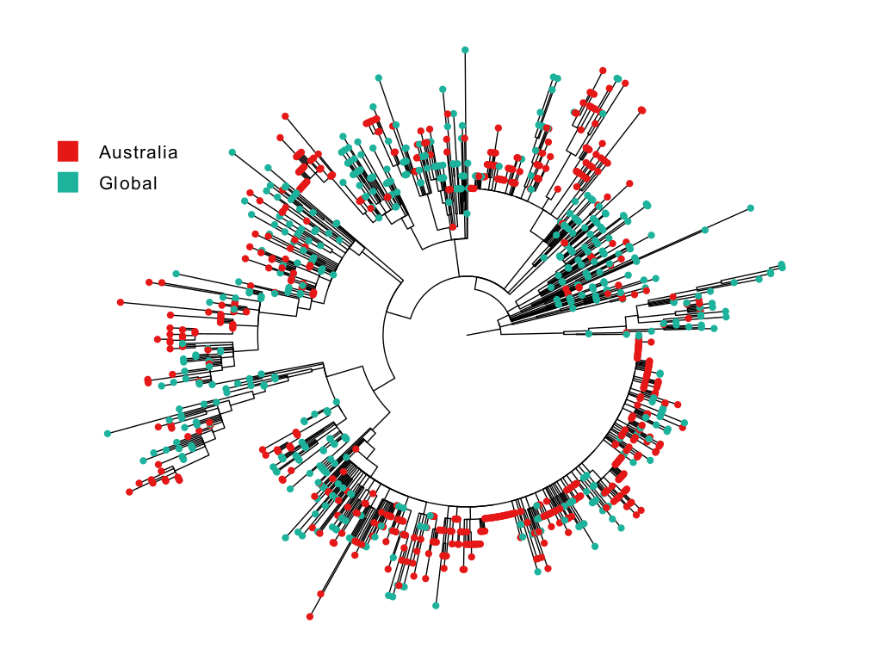

# Lab pipelines
A mix of pipelines for a variety of different tasks.

### phylogeny wih/without downsampling per region.
`src/tree.pipe.snk` : Given multiple fasta files (one per region of interest, e.g. Europe, Africa, Asia, etc), the pipeline downsamples the fasta files selected (i.e. it reduces the dataset to `x` samples per month) and keeps a selected fasta file without downsampling (e.g. Australia). Next, it generates the required metadata files and perform a maximum likelihood phylogenetic analysis (RAxML) and an optimized time-scaled phylogeny (TreeTime)

**Input files:** (1) Folder with fasta samples (to be downsampled) and (2) Single fasta to keep as it is. 

_Usage_:
`snakemake --snakefile tree.pipe.snk -j 8 --config ifa=gisaid/ nsamples=5 ausfa=gisaid/australia/h1n1pm_australia.fasta out=out_pipe/ -np`

(-j : number of cores)

**Output files:** RAxML and TreeTime phylogenies. Metadata file (`meta.csv`) to be imported in [FigTree](http://tree.bio.ed.ac.uk/software/figtree/). After figtree edition, an example result is:

_Dependencies:_ [RAxML]((https://cme.h-its.org/exelixis/web/software/raxml/index.html)), [TreeTime]((https://github.com/neherlab/treetime)), [MAFFT](https://mafft.cbrc.jp/alignment/software/) 

[!] _Considerations:_ (1) Check alignment (`all.alg.fasta`) and repeat phylogeny steps. (2) In some cases, there are samples which are inconsistent (`root_to_tip_regression.pdf`), identify them, remove and repeat last steps.

All pipelines are coded using [Snakemake](https://snakemake.readthedocs.io/en/stable/) and make use of [Python3](https://www.python.org/) and [Biopython](https://biopython.org/).